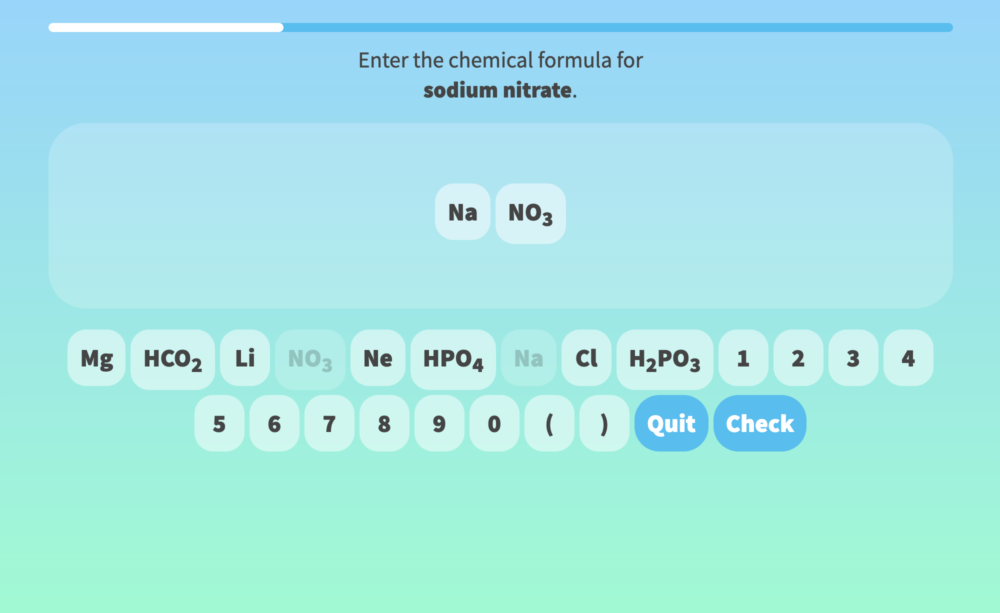

# Shells

Full-stack web application that provides a dynamic quiz platform for chemistry students, focusing on simple inorganic nomenclature. Written for the LAMP stack with minimal dependencies.

## Background

I began this project in 2017, when I was teaching undergrad General Chemistry courses and wanted to provide another way for students to drill certain basic concepts quickly and easily. I knew very little about web development then, and the project started as a mobile app developed in Unity. In 2019, I revisited the project and implemented it using a rudimentary LAMP stack, with JQuery as the only dependency.

Having acquired the necessary skills since then, I hope to refactor this project using modern web technologies. In particular, the JQuery-only implementation of a single page interface is rather painful to revisit!

## Usage

For now, this repository is an archive for the legacy code, and is not very portable. Still, it may be interesting to peruse in its current state. A MERN-based refactor will be forthcoming.